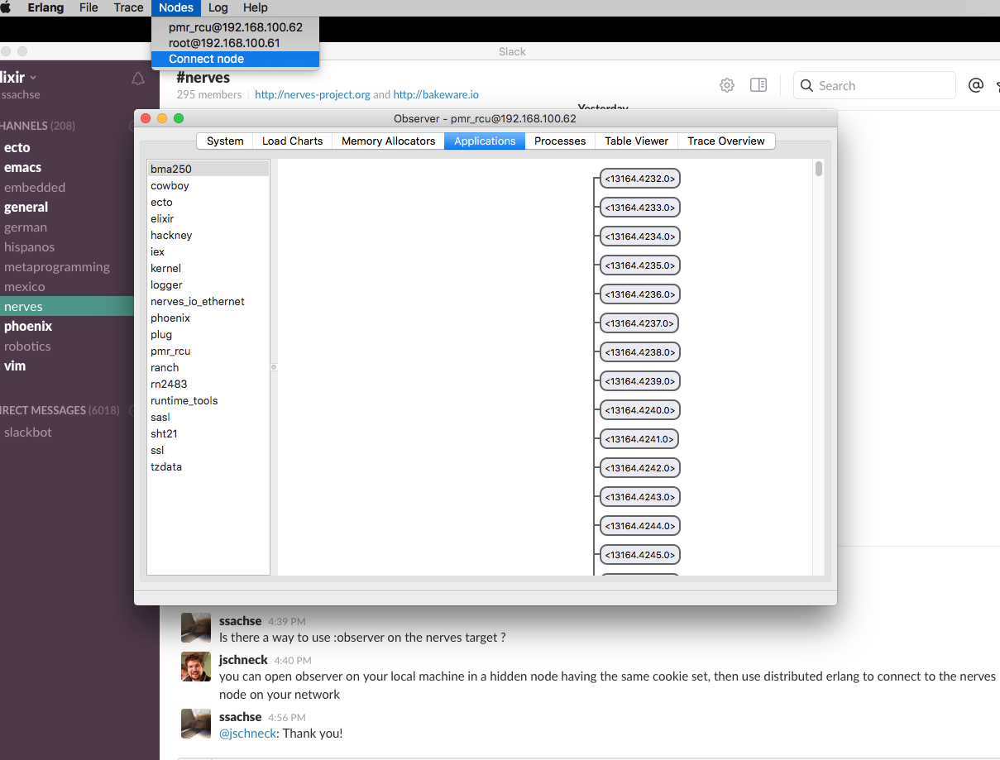

# my_elixir_notes
Here I just write down notes, Ideas and solution I come over in learning Elixir especially based on nerves/bakeware

## How I use IEX --remsh in development
In order to check the setup in a nerves box I put following into the vm.args file
```elixir
# rel/vm.args
## Name of the node
-name <node-name>@<ip-address>

## Cookie for distributed erlang
-setcookie secret
```
In the application I use Nerves.Io.Ethernet to setup eth0
```elixir
      case Ethernet.setup(:eth0) do
        {:ok, _pid} -> Logger.info "dynamic IP #{Nerves.IO.Ethernet.settings(:eth0)[:ip]}"
        _           -> {:ok, _pid} = Ethernet.setup( :eth0, mode: "static", ip: "10.0.0.5", router:
                                     "10.0.0.1", mask: "16", subnet: "255.255.0.0", mode: "static",
                                     dns: "8.8.8.8 8.8.4.4")
                                     Logger.info "static IP #{Nerves.IO.Ethernet.settings(:eth0)[:ip]}"
      end
```
Now I can use on my development machine
```elixir
iex --name console@<local-ip> --remsh <node-name>@<ip-address> --cookie secret 
```

## What is my development setup
Well I am using vim on my mac. Since I am trying a lot of things depending on the hardware of the nerves box I did setup a raspberry pi with raspian an a full blown elixir stack. I connect to this box with ssh from my mac. Since I feel it more pleasent to use vim on the mac I just put an alias in my zsh.
```sh
alias push_rpi='rsync --progress -arv --exclude=".git" --exclude="_images" --exclude="_build" --exclude="deps" ~/nerves/project1/ root@raspi:~/project1'
```
So I can edit everything on the mac and just sent a :!push_rpi from vim an have it deployed to the development box.
And when everything works I deploy it using bake to the nerves box 

## How Do I use Erlang :observer on the nerves target ?
Thanks to Justin Schneck it's really easy. On the development machine you start a hidden IEx session
```elixir
iex --name observer@<local-ip> --cookie secret
```
With the same cookie like on the nerves box
On the nerves box you add
```elixir
def application do
...
  applications: [ ...
                  :runtime_tools,
                  ...
                  ]
 ...
 end
 ```
 Now you can start Observer
 ```elixir
 Erlang/OTP 18 [erts-7.2.1] [source] [64-bit] [smp:8:8] [async-threads:10] [hipe] [kernel-poll:false] [dtrace]

Interactive Elixir (1.2.2) - press Ctrl+C to exit (type h() ENTER for help)
iex(observer@192.168.1.1)1> :observer.start
:ok
```


## nerves: How can I include other drivers

Thanks to Information from https://elixir-lang.slack.com/team/jschneck you do following

On a linux VM (Ubuntu 14.04) 
```sh
git clone https://github.com/nerves-project/nerves_system_br
```
install
```sh
sudo apt-get install git g++ libssl-dev libncurses5-dev bc m4 make unzip cmake
```
```sh 
git clone https://github.com/nerves-project/nerves_system_bbb
```

copy the linux config from nerves_system_br, for bbb located here https://github.com/nerves-project/nerves_system_br/board/bbb/linux-4.1.defconfig to nerves_system_bbb
```sh
cp board/bbb/linux-4.1.defconfig ../nerves_system_bbb
```
edit the line  https://github.com/nerves-project/nerves_system_rpi/blob/develop/nerves_defconfig#L30 to
```sh
BR2_LINUX_KERNEL_CUSTOM_CONFIG_FILE="${NERVES_DEFCONFIG_DIR}/linux-4.1.defconfig" 
```
in the linux defconfig, you are going to add `CONFIG_RTL8192CU=m
And do
```sh
./create-build.sh ../nerves_system_bbb/nerves_defconfig ./bbb_build 
```

Now generate the tar file that you can move and decompress somewhere on your mac.
```sh
cd ./bbb_build
make system
```
then from the nerves project do
```sh
export NERVES_SYSTEM=/path/to/decompressed/system
mix firmware
```

## How to inspect a long list

```elixir
File.ls("/lib/firmware") |> IO.inspect limit: :infinity
```
